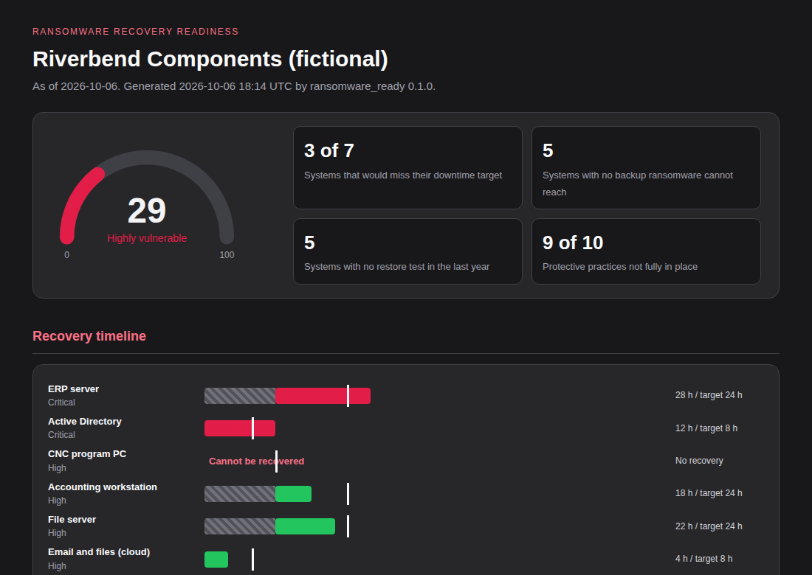

# Ransomware Resilience Framework

[](https://github.com/Edward-Owusu/ransomware-resilience-framework/actions/workflows/tests.yml)
[](LICENSE)

An open-source tool that answers one question for **small and mid-sized organizations**: *if ransomware encrypted everything tonight, could we recover our critical systems in time?* It produces a **recovery-readiness score**, a **recovery timeline** comparing how long each system would take to restore with how long the business can be without it, and a prioritized list of fixes, based on CISA and NIST ransomware guidance and mapped to **NIST SP 800-53 Rev. 5**.



## Why this matters

Ransomware remains one of the most disruptive threats to U.S. organizations, and small and mid-sized organizations, including manufacturers, healthcare providers, and local suppliers, are frequent victims. For them, the difference between a bad week and closing the doors usually comes down to one thing: whether they can restore their systems without paying.

Many believe they are covered because "we have backups." In practice, backups are often stored on the same network with the same administrator passwords, so ransomware encrypts them too. Restores have never been tested, and nobody has worked out that the business application cannot come back until the sign-in server is rebuilt first. These gaps only become visible during an attack, when it is too late.

This tool makes them visible beforehand. It turns a short inventory of critical systems and backup practices into a clear picture of what could be recovered, how long it would take, and what to fix first, in language an owner or IT provider can act on. More resilient small organizations mean fewer disrupted supply chains, hospitals, and local services when attacks happen.

## What it does

- Calculates each system's **effective recovery time**, including time spent waiting for systems it depends on, and compares it with the business's **recovery time objective**.
- Compares backup frequency with the **recovery point objective** to show where more data would be lost than the business can accept.
- Runs **9 system checks**: no backup, no offline or immutable copy, recovery or data loss beyond targets, untested restores, estimated rather than measured restore times, backups sharing production credentials, unmonitored and unencrypted backups.
- Reviews **10 protective practices**, such as MFA on remote access, a ransomware response playbook, segmentation, and prompt patching of internet-facing systems.
- Produces a **0 to 100 readiness score** shown on a gauge, with bands from Highly vulnerable to Resilient.
- Draws a **recovery timeline** showing which systems recover within target, which miss it, and where dependencies cause delays.
- Maps every finding to **NIST SP 800-53 Rev. 5** controls (CP-2, CP-4, CP-9, CP-10, AC-6, IR-8, and others).
- Produces reports in **HTML, Markdown, CSV, and JSON**, with a command-line tool and an interactive **Streamlit dashboard** where practices can be adjusted to see their effect.
- Has **no third-party dependencies** in its core engine.

## Quick start

Requires Python 3.10 or later.

```bash
git clone https://github.com/Edward-Owusu/ransomware-resilience-framework.git
cd ransomware-resilience-framework
pip install -e .

ransomware-check samples/riverbend_components_systems.csv --practices samples/riverbend_components_practices.json --format html md
```

Example output:

```
Riverbend Components (fictional) | 7 systems | as of 2026-10-06
Readiness: 29/100 (Highly vulnerable) | systems 30, practices 26
Miss downtime target: 3 | No safe backup copy: 5 | Untested restores: 5
  ERP server                   critical  recovery 28 h            target 24 h
  Active Directory             critical  recovery 12 h            target 8 h
  CNC program PC               high      recovery cannot recover  target 12 h
  ...
```

In this example the ERP server could be restored in 16 hours on its own, within its 24-hour target, but it cannot start until Active Directory is rebuilt, which takes 12 hours. The real recovery time is 28 hours.

Open the HTML file in the `reports` folder for the gauge and timeline. Pre-generated reports are in [docs/example-reports](docs/example-reports).

### Dashboard

```bash
pip install -r requirements.txt
streamlit run app/streamlit_app.py
```

### Use in automation

`--fail-below <score>` exits with code 2 when readiness falls below the given score:

```bash
ransomware-check systems.csv --practices practices.json --fail-below 60
```

## Assessing your own organization

1. List your critical systems in a copy of `samples/systems_template.csv`, with business targets and backup details, as described in the [input reference](docs/data-reference.md).
2. Answer the ten practices in `samples/practices_template.json`, or set them in the dashboard sidebar.
3. Run the tool, fix the top findings, and run a timed restore test to replace estimates with measurements.

## Related projects

Part of a series of open-source GRC tools for small and mid-sized organizations:

- [NIST SP 800-53 Assessment Tool](https://github.com/Edward-Owusu/Nist-800-53-assessment-tool)
- [Zero Trust IAM Auditor](https://github.com/Edward-Owusu/Zero-trust-iam-auditor)
- [MFA Compliance Tracker](https://github.com/Edward-Owusu/mfa-compliance-tracker)
- [FedRAMP Cloud Analyzer](https://github.com/Edward-Owusu/fedramp-cloud-analyzer)
- [CMMC Readiness Toolkit](https://github.com/Edward-Owusu/cmmc-readiness-toolkit)
- [Vendor Risk Dashboard](https://github.com/Edward-Owusu/vendor-risk-dashboard)

## Data and limitations

All sample data is synthetic and does not describe any real organization. The readiness score is a transparent planning aid, not a prediction of whether an attack will succeed, and restore times should be confirmed by timed tests. This tool does not replace an incident response plan, legal counsel, or professional incident response support. See the [methodology](docs/methodology.md).

## References

- CISA and partners, #StopRansomware Guide: https://www.cisa.gov/stopransomware
- NIST IR 8374, *Ransomware Risk Management: A Cybersecurity Framework Profile*: https://csrc.nist.gov/pubs/ir/8374/final
- NIST SP 800-53 Rev. 5, *Security and Privacy Controls for Information Systems and Organizations*: https://csrc.nist.gov/pubs/sp/800/53/r5/upd1/final
- NIST SP 800-34 Rev. 1, *Contingency Planning Guide for Federal Information Systems*

## Author

**Edward Owusu, CISA**, GRC Analyst and IT Auditor.

Feedback, issues, and contributions are welcome. If you use this tool in your organization, I would be glad to hear how it worked for you; please open an issue or get in touch.

## Citation

If you use this tool in research or professional work, please cite it using the metadata in [CITATION.cff](CITATION.cff).

## License

[MIT](LICENSE)
